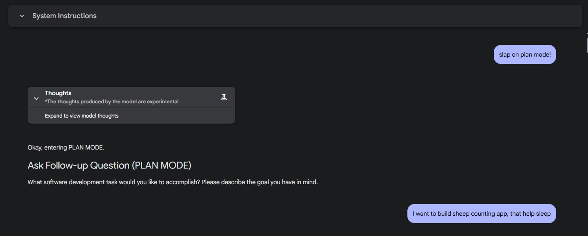
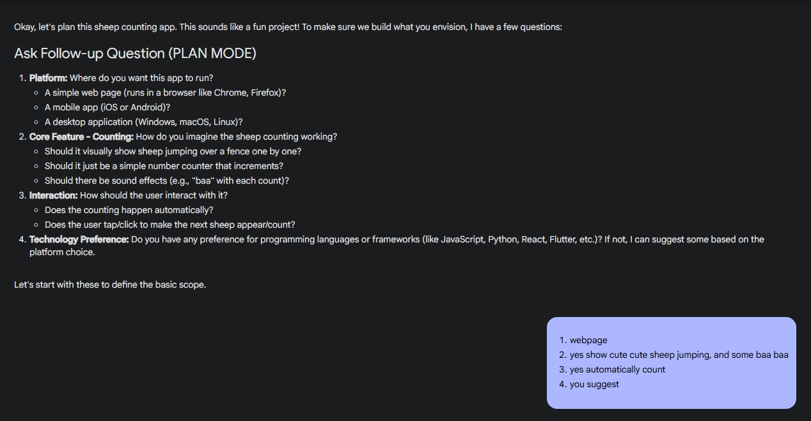
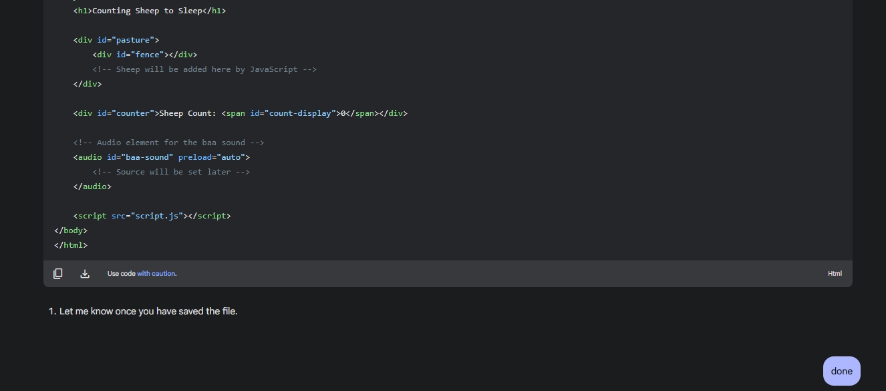
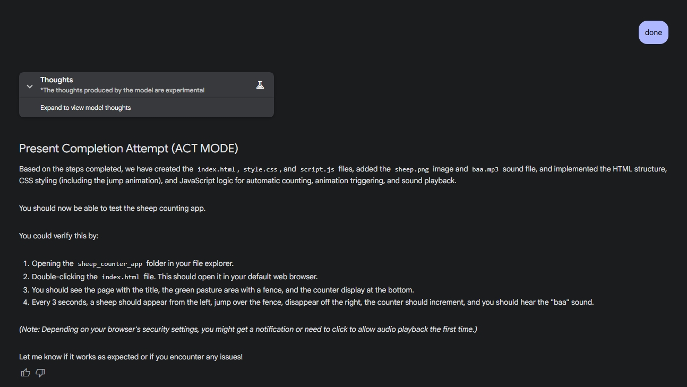
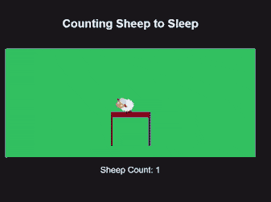

# 💥 Slap some Sense into your Boring AI! 💥

[](https://opensource.org/licenses/MIT) <!-- Replace with your actual license badge -->

**Don't have premium API access? Stuck with only a chat interface? NO PROBLEM!**

Tired of your AI sounding like a glorified autocomplete? Want it to *actually* help you code like a real agent, even in a basic chat window? This project is your weapon. We're turning those sometimes-shitty text generators into **cool coding agents FOR FREE!**

And yeah, it can actually offload your work. This is your lifetime opportunity to **become coding dumb** (in the best way possible)! 🥳

---

## ✨ Inspiration

Inspired by **Cline**, this project generates a dynamic system prompt tailored to *your* project and *your* machine. No more generic advice – get instructions that actually work on *your* setup.

---

## 🎯 The Deal

All you have to do is run **one simple script** in your project's working directory. Boom! You get an **ultra-slapping prompt** ready to paste into your AI chat.

This prompt forces the AI to:

*   Listen to your misery (your coding task).
*   Understand your pain (the requirements).
*   Make a *real* plan (and ask you if it's okay!).
*   Ask clarifying questions instead of guessing.
*   Guide you step-by-step, giving you OS-specific commands.

For the first time, **YOU get to be the dumb guy** (or gal!) and offload the thinking to your coding agent. Just like those Silicon Valley CEOs offload everything to their underpaid interns. 😉

---

## 🔥 Feature List

*   **OS-Aware Commands:** Automatically generates `PowerShell` (Windows) or `Bash/Shell` (Linux/macOS) command examples. No more `ls` on Windows!
*   **Structured Guidance:** Forces the AI into a strict `PLAN` -> `CONFIRM` -> `SUMMARIZE` -> `ACT` workflow.
*   **User-Controlled Execution:** The AI *tells* you what to do; *you* run the commands. Safety first!
*   **Chat Formats:** Standardized instructions for running commands, editing files, providing context, etc.
*   **Easier Edits:** It'll give you *entire code blocks* (functions, classes, even files!) instead of tedious line-by-line changes. **Less brain-frying for you!**
*   **Expert Mode:** Use the `--expert` flag to inject specific goals or tech stack focus into the prompt.
*   **Cross-Platform:** Run it with Python (recommended!), Bash/Zsh, or PowerShell.
*   **Zero Cost:** Works with free chat service like gemini.
*   **Open Source:** Use it, abuse it, improve it.

---

## 🚀 Usage

Clone the repo, `cd` into it, and run the script for your OS:

```bash
git clone https://github.com/JonyBepary/SlapAgent.git
cd SlapAgent
```

### Python (Recommended 👍)

(Requires Python 3.6+)

```bash
# Default - Just generate the prompt
python slap.py

# Expert - Add your own focus
python slap.py --expert
```

The script spits out `generated_prompt.md`. Copy the contents of that file and paste it as the system prompt or the very first message in your chat with the AI.

---

## ⚡ One-Liner Execution (Feeling Lucky?)

Don't want to clone? Live dangerously!

⚠️ **Warning:** Piping `curl` or `irm` to your shell executes remote code. Trust the source (review the code URL first!) or don't run these.

### 1. Linux / macOS (Bash/Zsh)

```bash
# Default (Replace URL!)
curl -sSL "https://raw.githubusercontent.com/JonyBepary/SlapAgent/refs/heads/main/src/slap.sh" | bash

# Expert (Replace URL!)
curl -sSL "https://raw.githubusercontent.com/JonyBepary/SlapAgent/refs/heads/main/src/slap.sh" | bash -s -- --expert
```

### 2. Windows (PowerShell)

```powershell
# Default (Replace URL!)
irm "https://github.com/JonyBepary/SlapAgent/raw/refs/heads/main/src/slap.ps1" | iex

# Expert (Replace URL! More complex due to flag)
$scriptBytes = irm "https://github.com/JonyBepary/SlapAgent/raw/refs/heads/main/src/slap.ps1" -UseBasicParsing; $tempScript = New-TemporaryFile -Extension ps1; Set-Content -Path $tempScript.FullName -Value $scriptBytes -AsByteStream; & $tempScript.FullName -Expert; Remove-Item $tempScript.FullName -Force
```

---

## 👀 Look at this Baby Slapping Sense into Gemini!

Here's the prompt in action, guiding the AI through a task:


*Slaping plan mode and give a prompt for dumb app*


*Ma boy Slapping and gave me plan and i just gave my choice*


*It's implementing and guiding to setup the project*


*AI was giving i was pasting*


*Ma man done playing*



<h1 style="text-align:center;">Result, So Dumb!</h1>


---

## 🤔 Why Use This, Again?

*   You want your chat AI to act like a real coding assistant.
*   You're tired of generic, non-actionable advice.
*   You want OS-specific commands without asking.
*   You believe the user should always be in control of execution.
*   You don't have/want expensive API access.
*   You enjoy making AI bend to your will.

---

## 🤝 Contributing

Got ideas to make this even *more* slap-happy? Found a bug?

1.  Open an issue.
2.  Fork it.
3.  Branch it (`git checkout -b slap/more-features`).
4.  Code it.
5.  Commit it (`git commit -am 'Added more slap'`).
6.  Push it (`git push origin slap/more-features`).
7.  Pull Request it.

---

## 📜 License

MIT License - basically, do whatever you want with it. See the [LICENSE](LICENSE) file. <!-- Make sure you have a LICENSE file -->
